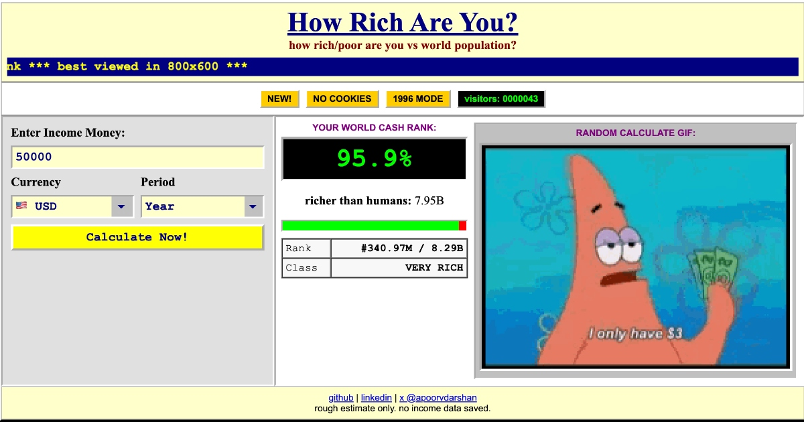

# How Rich Are You?

A dependency-free 90s-style web calculator that turns income into a playful global rank estimate.



Live site: https://how-rich-are-you.aopv.dev/

## Features

- 90s-style single-page income rank calculator.
- Desktop layout shaped for a 1200x630 Open Graph-style preview.
- Mobile responsive layout with stacked form/results.
- Most-used currency dropdown with flags.
- 100-item broke/rich meme GIF reaction pool from bundled files plus hardcoded Giphy/Tenor media URLs.
- One shuffled random GIF appears only after each calculation.
- Vercel Web Analytics for deployed page views and a `Calculate` custom event.
- Old-school visible visitor counter that increments once per page load.
- Open Graph and Twitter/X preview image at `assets/og-image.jpg`.

Run it locally:

```sh
python3 -m http.server 3000
```

Then open `http://localhost:3000`.

## Data Notes

This is a toy estimate, not financial advice or a rigorous statistical product. The percentile curve is hand-shaped from public global inequality guideposts and deliberately shown as approximate.

References used for context:

- UN World Population Prospects 2024: https://www.un.org/development/desa/pd/world-population-prospects-2024
- World Inequality Report 2022 / WID.world: https://wir2022.wid.world/executive-summary/

## License

MIT
